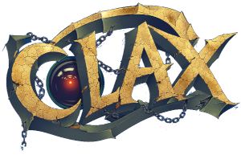

# clax — the Clax V2 transpiler

`clax` transpiles **Clax** (`.cx`) — a small C-with-classes language — to plain
C. It implements the object model described in
[Clax-Specification-V2.md](Clax-Specification-V2.md): `::`, `new`/`delete`,
`this`, `Object`, `typeof`, `clone`, NULL safety, and a generated shared
runtime. A bundled standard library (`system/*.cx`) provides `String`,
`DynamicArray*`, `HashTable*`, and friends.

## Build & install

```sh
./configure              # or: ./configure --prefix=$HOME/.local
make
sudo make install
```

This installs:

| Path | Contents |
|------|----------|
| `<bindir>/clax`            | the transpiler |
| `<bindir>/clax_lint`       | symlink to `clax`; lint-only mode |
| `<datadir>/clax/system/`   | standard library (`*.cx`) |
| `<docdir>/`                | the language specification |
| `<mandir>/man1/clax.1`     | man page |

Defaults follow the GNU layout (`prefix=/usr/local`). Override any directory:

```sh
./configure --prefix=/usr --datadir=/usr/share --mandir=/usr/share/man
```

Honoured variables (flags or environment): `CC`, `CFLAGS`, `LDFLAGS`.
Staged installs work via `DESTDIR`:

```sh
make DESTDIR=/tmp/stage install
```

### Other make targets

- `make examples`      — transpile + compile `examples/project` (no external deps).
- `make examples-glfw` — build `examples/glfw_project` (needs `glfw3` via pkg-config).
- `make examples-sdl2` — build `examples/sdl2_project` (needs `sdl2` via pkg-config).
- `make check`         — lint the bundled example as a smoke test.
- `make uninstall`, `make clean`, `make distclean`.

The bundled example projects live under [examples/](examples/).

## Usage

```sh
clax --init-project ~/myapp     # scaffold a new project
cd ~/myapp && ./build.sh        # build.sh is pre-wired to the installed system/ lib

# starter projects for graphics (each scaffolds main.cx + Button.cx + a
# pkg-config build.sh; needs the matching dev libraries installed):
clax --init-sdl2-project ~/mygame   # SDL2
clax --init-glfw-project ~/mygl     # GLFW + OpenGL

# or transpile an existing project directly:
clax --include=/usr/local/share/clax/system ./project
cc -O2 -o program project/generated_c/*.c
```

See `man clax` for the full option list.

Damir Šijaković (c) 2026.
